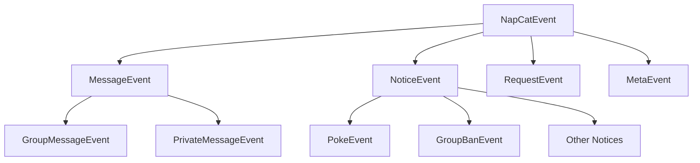
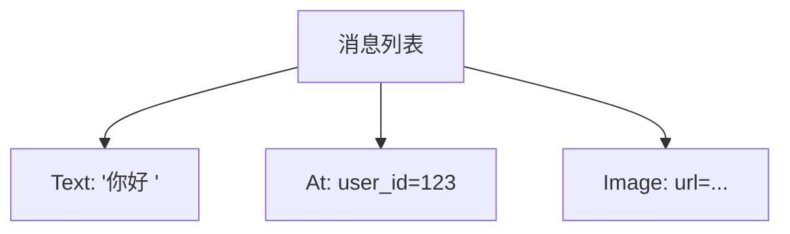

# 事件与消息体系

在 NapCat-SDK 中，我们拒绝处理裸露的 JSON 字典。 所有的网络数据流，在到达你的 Handler 之前，都已经被 SDK 自动清洗、验证并封装成了具有强类型定义的**对象**。

这不仅是为了代码好看，更是为了让 IDE 成为你最强的编程助手。

## 1. 事件体系：对象即分类

NapCat 定义了一个庞大的事件家族树。当一个事件发生时，SDK 会根据 `post_type` 和 `detail_type` 自动实例化出最精确的子类。

这意味着你不需要写复杂的 `if data["post_type"] == "message"` 判断，而是使用 Pythonic 的类型检查：

### 核心层级

所有事件都继承自 `NapCatEvent`。



### 实战中的直觉

在 Handler 中，利用 `isinstance` 进行“模式匹配”，IDE 会自动推断出该类型特有的字段。

```python
from napcat import NapCatClient, GroupMessageEvent, FriendRequestEvent

async for event in client:
    # 场景 1: 处理群消息
    if isinstance(event, GroupMessageEvent):
        # IDE 知道 GroupMessageEvent 一定有 group_id
        print(f"群 {event.group_id} 收到消息: {event.raw_message}")
        await event.reply("收到！")

    # 场景 2: 处理好友申请
    elif isinstance(event, FriendRequestEvent):
        # IDE 知道 FriendRequestEvent 有 approve() 方法
        print(f"收到好友申请: {event.comment}")
        await event.approve(remark="也就是个自动备注")
```

> **🛡️ 兜底机制**：如果 NapCat 服务端更新了新的事件类型，而 SDK 尚未适配，SDK 不会崩溃，而是会返回一个 `UnknownEvent` 或 `UnknownNoticeEvent`，保留原始字典供你访问 (`event.raw_data`)。

## 2. 消息链：拒绝正则，拥抱积木

在 NapCat 中，一条消息**不是**一个简单的字符串，而是一个由 **消息段** 组成的列表（链）。

这就像搭积木一样：一条包含“文字 + @某人 + 表情包”的消息，本质上是三个对象的组合。

### 消息的构成



### 构建与发送

SDK 提供了预定义的 `MessageSegment` 类（如 `Text`, `Image`, `At`, `Face` 等），让你像写代码一样组装消息，彻底告别繁琐的 CQ 码拼接。

```python
from napcat import NapCatClient, Text, At, Image, Dice

# 发送一条混合消息
await client.send_group_msg(
    group_id="123456",
    message=[
        At(qq="987654"),           # @某人
        Text(text=" 来看这个！"),   # 纯文本
        Image(file="https://..."), # 图片
        Dice(result=6)             # 骰子
    ]
)
```

### 接收与解析

当收到消息时，`event.message` 已经被解析为对象列表。你不需要用正则表达式去匹配 `[CQ:at,qq=...]`，直接遍历列表即可。

```python
async for event in client:
    if isinstance(event, GroupMessageEvent):
        # 遍历消息段
        for seg in event.message:
            if isinstance(seg, Image):
                print(f"收到图片，URL: {seg.url}")
            elif isinstance(seg, At):
                print(f"有人艾特了: {seg.qq}")
```

<details> <summary><strong>✨ Python 3.10+ 独占 Trick：结构化模式匹配</strong></summary>
<p>
如果你在使用 Python 3.10 或更高版本，NapCat-SDK 的数据结构完美支持 match-case 语法。 最强大的地方在于，你可以直接匹配<b>整条消息链的结构和顺序</b>，甚至可以在匹配时直接进行逻辑判断。
</p>
<p>
<b>典型案例：</b> 假设我们要匹配一条指令，格式必须严格为：@机器人自己 + 文本"搜索" + 一张图片。
</p>

```python
from napcat import Text, Image, At

# 提前准备好机器人的 QQ 号 (str类型)
self_uid = str(client.self_id)

# event.message 本质是一个列表，我们可以直接匹配列表结构
match event.message:
    # 场景：匹配 [At, "搜索", 图片] 的固定顺序，且at的qq必须是机器人自己
    case [At(qq=target_uid), Text(text="搜索"), Image(url=img_url)] if target_uid == self_uid:
        print(f"收到搜图指令！")
        print(f"搜索图片: {img_url}") # 这里直接解包了 url 变量

    # 场景：匹配以 "帮助" 开头，后面跟任意内容的消息
    case [Text(text="帮助"), *rest]:
        print(f"用户在请求帮助，后续参数: {rest}")

    case _:
        pass # 忽略不符合格式的消息
```
<p>
这种写法不仅消灭了无数个 `if` 和 `len()` 判断，还能直接将 `qq` 和 `url` 解包赋值给变量，让指令解析逻辑变得极其清晰。
</p>
👉 <b>进阶阅读</b>：关于模式匹配在 NapCat 中的更多高级用法，请参阅后续章节。

</details>

## 3. 为什么我们要这么设计？

看完这三章核心概念，你可能发现了 NapCat-SDK 的设计共性：**“严谨的包装，自然的调用”**。

1. **Client/Server**：封装了 WebSocket 的复杂性，给你 `async for` 的自然流。
2. **API**：封装了网络请求，给你 `await client.func()` 的函数调用感。
3. **Event/Message**：封装了 JSON 解析，给你强类型的对象操作。

我们做这些繁琐的底层封装，就是为了让你在写业务逻辑时，能享受到**“点（.`dot`）哪里，都有提示”**的极致开发体验。